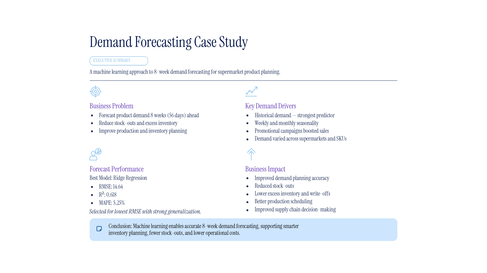

# Demand Forecasting Case Study

## Eight-Week Ahead Demand Forecasting using Machine Learning

<p align="center">


</p>

---

An end-to-end Machine Learning project for forecasting supermarket product demand using historical sales and promotional data. The project demonstrates a complete forecasting pipeline, from data exploration and feature engineering to model development, evaluation, and business-oriented forecast generation.


# **Project Overview**

Demand forecasting is a critical component of inventory management, supply chain optimization, and production planning. Reliable forecasts enable businesses to maintain optimal inventory levels, reduce operational costs, minimize stock-outs, and avoid excess inventory.

This project presents an **end-to-end Machine Learning forecasting pipeline** capable of predicting product demand **eight weeks in advance** for multiple supermarket–SKU combinations. The solution integrates historical demand data with promotional information to generate accurate forecasts that support data-driven inventory planning.

The project follows a structured Machine Learning workflow consisting of **Exploratory Data Analysis (EDA), data preprocessing, feature engineering, model development, hyperparameter optimization, model evaluation, and forecast generation**. The resulting pipeline is reproducible, interpretable, and designed to address a real-world business forecasting problem.

---

# **Business Problem**

Retail organizations rely on accurate demand forecasts to ensure products are available when customers need them while avoiding unnecessary inventory costs. In this case study, the demand planning team experienced a decline in forecasting performance after the departure of an experienced planner, leading to several operational challenges:

- Frequent stock-outs for high-demand products.
- Excess inventory for low-demand products.
- Increased inventory holding costs.
- Higher product write-offs due to overproduction.
- Inefficient production and replenishment planning.

The objective of this project is to develop a Machine Learning model capable of forecasting product demand **eight weeks ahead** for each supermarket–SKU combination, enabling more informed production planning and inventory management decisions.

---

# **Project Objectives**

The primary objectives of this project are to:

- Perform comprehensive **Exploratory Data Analysis (EDA)**.
- Assess data quality and identify demand patterns.
- Identify the key factors driving product demand, including seasonality, historical demand, and promotional campaigns.
- Engineer meaningful time-series features.
- Train and compare multiple forecasting models.
- Optimize model performance through hyperparameter tuning.
- Evaluate forecasting accuracy using multiple regression metrics.
- Select the best-performing forecasting model.
- Generate business-ready demand forecasts.

---

# **Key Features**

- End-to-End Machine Learning Pipeline
- Exploratory Data Analysis (EDA)
- Data Cleaning and Preprocessing
- Calendar-Based Feature Engineering
- Promotion Feature Engineering
- Lag Feature Engineering
- Rolling Statistical Features
- Time-Based Train-Test Split
- Multiple Machine Learning Models
- Hyperparameter Optimization using RandomizedSearchCV
- Comprehensive Model Evaluation
- Forecast Generation
- Business Interpretation
- Professional Repository Organization

---

# **Technology Stack**

| Category | Technologies |
|----------|--------------|
| **Programming Language** | Python |
| **Data Analysis** | Pandas, NumPy |
| **Data Visualization** | Matplotlib, Seaborn |
| **Machine Learning** | Scikit-learn, XGBoost |
| **Model Persistence** | Joblib |
| **Development Environment** | Jupyter Notebook |
| **Version Control** | Git & GitHub |

---

# **Project Structure**

```text
Demand-Forecasting-Case-Study/
│
├── data/
│   ├── raw/
│   │   ├── demand.csv
│   │   └── promotions.csv
│   │
│   └── processed/
│       └── final_dataset.csv
│
├── notebooks/
│   ├── 01_EDA.ipynb
│   ├── 02_Feature_Engineering.ipynb
│   └── 03_Model_Training.ipynb
│
├── models/
│   ├── best_model.pkl
│   ├── sku_encoder.pkl
│   └── supermarket_encoder.pkl
│
├── outputs/
│   ├── figures/
│   └── predictions/
│       └── forecast.csv
│
├── presentation/
│   └── Summary.pdf
│   └── Summary.jpg
|   
│
│
├── README.md
├── requirements.txt
├── .gitignore
```

---

# **Project Workflow**

```text
                    Historical Demand Data
                               │
                               ▼
             Exploratory Data Analysis (EDA)
                               │
                               ▼
              Data Cleaning & Preprocessing
                               │
                               ▼
                 Feature Engineering
     (Calendar + Promotion + Lag + Rolling Features)
                               │
                               ▼
              Chronological Train-Test Split
                               │
                               ▼
                 Baseline Forecast Model
                               │
                               ▼
          Linear Regression & Ridge Regression
                               │
                               ▼
   Random Forest & XGBoost (Hyperparameter Tuning)
                               │
                               ▼
              Model Performance Evaluation
                               │
                               ▼
                 Best Model Selection
                               │
                               ▼
                Demand Forecast Generation
                               │
                               ▼
             Business Insights & Decision Support
```

---

# **Dataset Description**

This project utilizes two datasets provided as part of the case study.

## **1. demand.csv**

This dataset contains the historical daily demand recorded for each supermarket–SKU combination.

| Column | Description |
|---------|-------------|
| **date** | Calendar date |
| **supermarket** | Supermarket chain (FreshMart, GreenBasket, DailyNeeds) |
| **sku** | Product (Organic Milk, Whole Wheat Bread, Free Range Eggs) |
| **demand** | Daily units sold |

The dataset spans **January 2019 to December 2021**, providing approximately three years of historical observations that form the basis of the forecasting models.

---

## **2. promotions.csv**

This dataset contains promotional campaigns conducted for selected supermarket–SKU combinations.

| Column | Description |
|---------|-------------|
| **promotion_date** | Promotion start date |
| **supermarket** | Supermarket chain |
| **sku** | Product |

Each promotional campaign lasts for **one week**. The promotional data was merged with the historical demand data to create a binary **Promotion** feature, enabling the forecasting models to learn the influence of promotions on future demand.

---


# **Exploratory Data Analysis (EDA)**

Before developing the forecasting models, a comprehensive **Exploratory Data Analysis (EDA)** was performed to understand the dataset, assess data quality, identify demand patterns, and uncover factors influencing product demand.

The analysis included:

- Dataset overview and structure
- Missing value analysis
- Duplicate record detection
- Summary statistics
- Demand distribution analysis
- Outlier detection
- Time-series trend analysis
- Monthly and yearly demand patterns
- SKU-wise demand comparison
- Supermarket-wise demand comparison
- Promotion impact analysis
- Correlation analysis of engineered numerical features

### **Key Findings**

- Missing values were present only in the **demand** column and were handled during preprocessing.
- No duplicate records were found in either dataset.
- Demand exhibited clear weekly seasonality along with long-term trends.
- Promotional campaigns significantly increased demand for several supermarket–SKU combinations.
- Certain products consistently recorded higher demand than others.
- Extreme demand values were primarily associated with promotional periods rather than data quality issues.

The insights obtained during the EDA phase guided the feature engineering process and supported the selection of appropriate forecasting models.

---

## **Demand Drivers Identified**

The exploratory analysis revealed several key factors that influence product demand:

- Historical Demand: Previous demand values were the strongest predictor of future demand, motivating the creation of lag features.
- Seasonality: Demand exhibited recurring weekly and monthly patterns, indicating the presence of seasonal purchasing behaviour.
- Promotions: Promotional campaigns consistently increased demand for the affected supermarket–SKU combinations.
- Demand Trends: Rolling averages and rolling standard deviations captured short-term demand trends and fluctuations, improving the model’s ability to forecast future demand.
- Product and Store Differences: Demand varied across different SKUs and supermarkets, highlighting the importance of modelling each supermarket–SKU combination individually.

These insights informed the feature engineering strategy and guided the selection of predictive variables used during model development.

# **Feature Engineering**

Since demand forecasting is inherently a time-series problem, several predictive features were engineered to capture seasonality, historical demand patterns, and promotional effects.

## **Calendar Features**

Calendar-based features were created to help the models learn recurring seasonal patterns.

| Feature | Description |
|----------|-------------|
| Year | Captures long-term demand trends |
| Month | Learns monthly seasonal variations |
| Quarter | Identifies quarterly demand patterns |
| Week of Year | Captures weekly seasonality |
| Day of Week | Models weekday purchasing behaviour |
| Day of Month | Identifies monthly purchasing trends |
| Weekend Indicator | Differentiates weekdays from weekends |

---

## **Promotion Feature**

Promotional campaigns strongly influence customer purchasing behaviour.

A binary **Promotion** feature was created by merging the promotional dataset with the historical demand dataset.

| Value | Description |
|-------|-------------|
| **0** | No active promotion |
| **1** | Product under promotion |

This feature enables the forecasting models to account for temporary demand increases during promotional periods.

---

## **Lag Features**

Historical demand is one of the strongest predictors of future demand. Lag features allow the model to learn temporal dependencies from previous observations.

The following lag features were generated:

| Feature | Description |
|----------|-------------|
| Lag 1 | Previous day's demand |
| Lag 7 | Demand one week earlier |
| Lag 14 | Demand two weeks earlier |
| Lag 28 | Demand four weeks earlier |
| Lag 56 | Demand eight weeks earlier |

---

## **Rolling Statistics**

Rolling statistics summarize recent demand behaviour and help smooth short-term fluctuations.

The following rolling features were created:

### **Rolling Mean**

- 7-Day Rolling Mean
- 14-Day Rolling Mean
- 28-Day Rolling Mean

### **Rolling Standard Deviation**

- 7-Day Rolling Standard Deviation
- 14-Day Rolling Standard Deviation
- 28-Day Rolling Standard Deviation

These features capture both the recent average demand and the variability of demand over different time windows.

---

## **Target Variable**

The forecasting objective was to predict product demand **eight weeks into the future**.

The target variable was created by shifting the **demand** column **56 days ahead**, enabling the models to learn historical demand patterns while forecasting future demand.

---

### Time-Based Train-Test Split

A chronological train-test split was used instead of a random split to preserve the temporal ordering of the data and prevent information leakage from future observations.

# **Machine Learning Models**

Five forecasting approaches were implemented and evaluated during this project.

| Model | Purpose |
|--------|----------|
| Persistence Baseline | Establishes a benchmark using previous demand |
| Linear Regression | Baseline linear forecasting model |
| Ridge Regression | Regularized linear model to reduce overfitting |
| Random Forest | Ensemble learning model capable of capturing non-linear relationships |
| XGBoost | Gradient Boosting model optimized using RandomizedSearchCV |

Hyperparameter optimization was performed for the tree-based models using **RandomizedSearchCV** to identify parameter combinations that provided the best generalization performance.

---

# **Evaluation Metrics**

Model performance was evaluated using multiple regression metrics to provide a comprehensive assessment of forecasting accuracy.

| Metric | Description |
|----------|-------------|
| **MAE** | Mean Absolute Error |
| **RMSE** | Root Mean Squared Error |
| **MAPE** | Mean Absolute Percentage Error |
| **R² Score** | Coefficient of Determination |

Among these metrics, **RMSE** was selected as the primary evaluation metric because larger forecasting errors have a greater impact on inventory planning, potentially leading to stock-outs or excess inventory.

---

# **Model Performance**

| Model | MAE | RMSE | R² | MAPE |
|------|------:|------:|------:|------:|
| Persistence Baseline | 3.285 | 16.094 | 0.538 | 4.96% |
| Linear Regression | 3.476 | 14.639 | 0.618 | 5.25% |
| Ridge Regression | **3.475** | **14.639** | **0.618** | 5.25% |
| Random Forest (Tuned) | 3.562 | 15.079 | 0.594 | 5.14% |
| XGBoost (Tuned) | **3.181** | 14.657 | 0.617 | **4.73%** |

---


# **Final Results**

| Metric | Ridge Regression |
|---------|----------------:|
| MAE | 3.48 |
| RMSE | 14.64 |
| R² | 0.618 |
| MAPE | 5.25% |

The Ridge Regression model was selected as the final forecasting model because it achieved the lowest RMSE and the highest R² score while maintaining a simple and interpretable architecture.
---

# **Final Model Selection**

Although the tuned **XGBoost** model achieved the lowest **MAE** and **MAPE**, the difference in performance compared with **Ridge Regression** was minimal.

Ridge Regression achieved:

- The lowest RMSE
- The highest R² Score
- Strong generalization performance
- Faster training and inference
- A simpler and more interpretable model architecture

Since minimizing large forecasting errors is particularly important for inventory planning, **Ridge Regression** was selected as the final forecasting model.

---

# **Forecast Output**

The selected Ridge Regression model was used to generate demand forecasts for the test dataset.

The generated **forecast.csv** contains the following information:

| Column | Description |
|---------|-------------|
| Date | Forecast date |
| Supermarket | Supermarket chain |
| SKU | Product |
| Actual Demand | Observed demand |
| Forecasted Demand | Model prediction |
| Forecast Error | Difference between actual and predicted demand |
| Absolute Error | Magnitude of forecasting error |

This forecast report can be directly used for inventory planning, production scheduling, and business decision-making.

---

# **Business Impact**

The developed demand forecasting pipeline provides actionable insights that can support retail inventory planning and supply chain operations. By forecasting product demand eight weeks in advance, the solution can help organizations:

- Improve demand planning accuracy.
- Reduce stock-outs by anticipating future demand.
- Minimize excess inventory and associated holding costs.
- Optimize production and replenishment schedules.
- Support data-driven inventory management decisions.
- Improve overall supply chain efficiency.
- Enhance customer satisfaction through better product availability.

Although this project is developed as a case study, the forecasting workflow demonstrates how machine learning can be applied to solve real-world demand planning problems in the retail industry.

---

# **Business Summary Presentation**

The following executive summary slide presents the key business insights from the project, including the business problem, demand drivers, forecasting performance, and expected business impact.

<p align="center">
    
</p>

The presentation is also available as a PDF:

- 📄 [Summary.pdf](presentation/Summary.pdf)

---
# **Installation**

Follow the steps below to set up the project locally.

## **1. Clone the Repository**

```bash
git clone https://github.com/Riruru612/Demand-Forecasting-Case-Study.git

cd Demand-Forecasting-Case-Study
```

---

## **2. Create a Virtual Environment**

### **Windows**

```bash
python -m venv venv

venv\Scripts\activate
```

### **macOS / Linux**

```bash
python3 -m venv venv

source venv/bin/activate
```

---

## **3. Install the Required Dependencies**

```bash
pip install -r requirements.txt
```

---

## **4. Launch Jupyter Notebook**

```bash
jupyter notebook
```

---

# **Project Execution**

Run the notebooks in the following order:

1. `01_EDA.ipynb`
2. `02_Feature_Engineering.ipynb`
3. `03_Model_Training.ipynb`

The notebooks are designed to be executed sequentially, where the output of one notebook serves as the input for the next stage of the pipeline.


---

# **Future Improvements**

Although the current forecasting pipeline provides reliable predictions, several enhancements can further improve forecasting performance and business value.

Potential future improvements include:

- Incorporating holiday calendars as additional features.
- Integrating weather information for weather-sensitive products.
- Including product pricing and discount information.
- Performing Time Series Cross Validation instead of a single train-test split.
- Experimenting with advanced forecasting models such as:
  - LightGBM
  - CatBoost
  - Prophet
  - LSTM Networks
  - Temporal Fusion Transformer (TFT)
- Deploying the forecasting model using FastAPI.
- Building an interactive forecasting dashboard using Streamlit.
- Automating model retraining with an MLOps pipeline.


---

# **Project Highlights**

- End-to-End Machine Learning Pipeline
- Business-Oriented Demand Forecasting
- Comprehensive Exploratory Data Analysis
- Advanced Feature Engineering
- Multiple Machine Learning Models
- Hyperparameter Optimization
- Comparative Model Evaluation
- Forecast Generation
- Professional Repository Organization
- Reproducible Workflow

---

# **Author**

**Riya Garg**

B.Tech Computer Science Engineering (Artificial Intelligence)

Bennett University

**Email:** riyagarg1512@gmail.com

**GitHub:** https://github.com/Riruru612

**LinkedIn:** https://www.linkedin.com/in/riya-garg-932904290/

---

# **License**

This project is intended for educational and learning purposes as part of a Machine Learning case study.

---


**Thank you for taking the time to explore this project. Feedback, suggestions, and contributions are always welcome.**

If you found this repository helpful, consider giving it a ⭐.